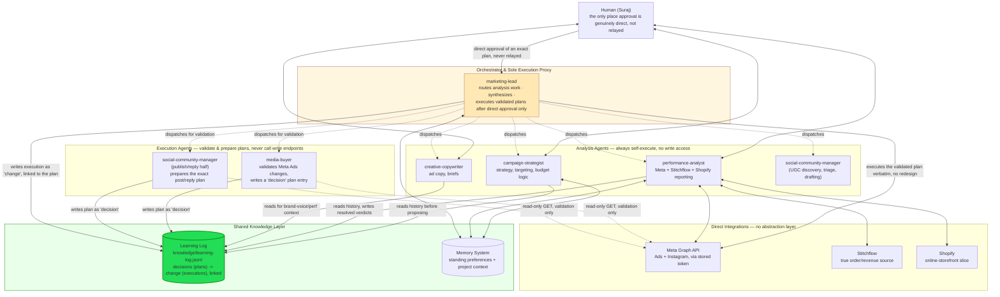

# K&A Meta Ads System — Agent System Architecture

**This is the single source of truth for how the K&A by Karishma and Ashita Meta Ads system is built and operates.** It's a living document, not a versioned snapshot — when the system changes, this document changes with it, in place. No more `-v2`, `-v3` files. Significant decisions are recorded in the **Architecture Change Log** at the end, not by forking a new document.

**Repo history note:** this project lived first as a Claude Code Desktop/CLI-only setup, then migrated to VS Code (`docs/current-architecture-migration-handover.md` documents that move in full), then migrated again — this repo, `K&A Meta Ads System`, dedicated and GitHub/droplet-native — out of a shared multi-project folder that also held two unrelated projects (Website Engineering, SEO & Discoverability). Both migrations are recorded in the Architecture Change Log below rather than as separate documents.

**Business context:** K&A is a bridal/couture fashion brand. Revenue is dominated by high-value made-to-order pieces sold via WhatsApp/DM/in-studio (recorded in Stitchflow, the order management system), with a smaller slice of self-serve online checkout via Shopify. Marketing runs on Meta (Facebook/Instagram) Ads plus organic Instagram.

---

## 1. Agent roster

All agents are defined as Markdown files with YAML frontmatter (`name`, `description`, `tools`) under `.claude/agents/`. Agents fall into two categories, split by a platform-level fact rather than a design preference (see §3 guardrail 1 for why): whether the agent's job ever requires a live, irreversible write to an external system.

### Analysis agents — always self-execute their own work

These read, reason, plan, and report. They never call a write/POST endpoint. They should always be dispatched to do their own specialist work — never performed by marketing-lead or the top-level session on their behalf.

| Agent | Role |
|---|---|
| **campaign-strategist** | Campaign structure, audience/targeting plans, funnel mapping. **Total portfolio budget allocation within the daily ceiling** (§Budget Policy), **standing strategic-intelligence owner** — internal performance, content discoveries, competitor ad activity (Meta Ad Library), and Meta platform/algorithm changes, each tested against "does this matter for K&A" before becoming a recommendation (§Strategic Intelligence) — and **standing Geographic & Customer Demographic Intelligence owner** (§3c): decides whether geography/age findings justify a strategic change. Produces plans/recommendations. |
| **performance-analyst** | Pulls Meta Ads performance data, cross-references with Stitchflow (true order source) and Shopify (online-only slice) for real attribution, flags anomalies, produces reporting digests. **Also measures geographic and customer-age performance** (§3c) — Stitchflow residence-based geography vs. Meta delivery, and actual customer age from optional DOB vs. Meta's own age-bracket performance, always reporting data coverage alongside any conclusion. |
| **creative-copywriter** | Ad copy, headlines, CTAs, creative briefs consistent with brand voice. |
| **social-community-manager** *(analysis/planning half)* | Scans Instagram for UGC/tags, triages what's worth reposting, drafts comment-reply suggestions, flags strong UGC to the ads team. This half is pure analysis and always self-executes. |

### Execution agents — validate and prepare, never execute themselves

These agents' domains involve live, real-money or real-public writes (Meta Ads changes; Instagram posts/replies). A platform-level safety property means a subagent can never treat a relayed message as the user's own direct consent for a live external action (see §3 guardrail 1) — so these agents' job is to **validate the proposed change, run risk checks, and prepare an exact, ready-to-execute plan** (old value → new value, rollback criteria, verification steps). They do not call the write endpoint themselves, regardless of what confirmation they're told has happened.

| Agent | Role |
|---|---|
| **media-buyer** | Validates and prepares execution plans for live Meta Ads changes — create/pause/enable campaigns, ad sets, ads; set budgets. Read-only access to Meta (GET calls for validation); never calls a write endpoint. |
| **social-community-manager** *(execution half)* | Prepares the exact post/repost/reply plan (caption or reply text, target id) once UGC/comment work has been triaged. Never calls the Instagram publish/reply endpoint itself. |

### Orchestrator

| Agent | Role |
|---|---|
| **marketing-lead** | Triages ambiguous requests and routes to the right specialist(s); synthesizes their findings into one answer. Does no specialist analysis itself. **Also the sole execution proxy**: after receiving the user's direct approval in the current conversation, executes the exact plan an execution agent validated — verbatim, no redesign or reinterpretation — then verifies, reports, and updates the learning log. This is the only agent (in practice, the top-level session acting in this role) that ever calls a live write endpoint, because it's the only place the user's messages are genuinely direct, not relayed. |

**How work gets routed:**
- Reporting / "how are we doing" → performance-analyst
- "Should we change targeting/strategy" → campaign-strategist
- "Write copy for X" → creative-copywriter
- "Who's tagging us / comments to reply to / repost this" → social-community-manager (triage/drafting)
- A proposed live Meta Ads change → media-buyer validates and prepares the plan; marketing-lead executes it after the user's direct approval
- A proposed Instagram post/repost/reply → social-community-manager prepares the plan; marketing-lead executes it after the user's direct approval
- Broad/ambiguous requests → marketing-lead, which routes to one or more specialists and synthesizes
- Chained work is common: strategist plans → copywriter writes → media-buyer validates the plan → marketing-lead executes after approval; or social-community-manager surfaces UGC → creative-copywriter briefs it → media-buyer validates the resulting ad → marketing-lead executes

## 2. Data & integration layer

No dedicated Meta Ads MCP server is used. Instead:

- **Meta Graph API** — called directly via shell (`curl`) using a stored System User access token (`meta_token.txt.txt`, kept out of any agent's visible output). Covers both Meta Ads (Marketing API) and Instagram (Graph API — tags, comments, content publishing). Current token scopes include `ads_management`, `instagram_basic`, `instagram_manage_comments`, `instagram_content_publish`, and related Instagram permissions.
- **Stitchflow** (MCP server) — read-only order/customer/revenue tools. Source of truth for total order volume and value, since most high-value orders never touch the website.
- **Shopify** (MCP server) — read-only order/product tools. The online-storefront slice only, not the full revenue picture.
- **Google Drive/Sheets** (MCP server) — used for one-off historical data extraction (a legacy pre-Stitchflow order ledger), not a live integration.
- **Windsor.ai is fully retired.** All agents call Meta directly. If a Windsor tool ever appears available, it should not be used for this account unless explicitly requested.

**Integration-change discipline:** after any account-wide tooling change (like the Windsor retirement was), grep every agent definition file for references to the old integration before considering the migration complete — this caught a real, live-for-weeks bug once already (see change log). Each agent file also carries a `**Last verified working:**` line, updated whenever it's confirmed working, as a cheap staleness signal.

**Learning-log writes (added 2026-08-19):** all agents append via `scripts/append-learning-log.sh`, never a raw `echo >>`. The script performs a safe fetch/rebase/append/commit/push-with-retry sequence — required now that the log has two possible writer environments (interactive VS Code, and unattended droplet cron runs) that could otherwise race. See `docs/learning-layer-design.md` for the full rationale and `docs/proactive-operations.md` for the two-environment runtime this protects against.

## 3. Operating principles / guardrails

Mostly enforced by instructions in each agent's definition, not by technical sandboxing — worth being clear-eyed about that. Guardrail 1 is the documented exception: it's an actual platform-level property, confirmed empirically (see §6, and the change log), not a convention this project wrote.

1. **A write-capable subagent can never treat a relayed message as the user's own direct consent for a live external action — this is a platform-level safety property, not a project convention, and it is not fought or worked around.** Every message a subagent receives arrives relayed by the orchestrating session; the platform's own governing instructions hold that no agent message is ever the user's consent, no matter how it's phrased, quoted, or corroborated (confirmed empirically on 2026-08-10 — see change log). **This is why the architecture is split into analysis agents and execution agents (§1):** execution agents (media-buyer; social-community-manager's publish/reply half) validate and prepare an exact plan, but never call the write endpoint. Only marketing-lead executes, and only after the user's direct approval lands in the actual conversation marketing-lead is part of — never via a relay from another agent.

   **Resolved 2026-08-21 (second legitimate direct-approval channel — Telegram button tap):** `scripts/telegram_approval_listener.py` (§8a, `docs/proactive-operations.md`) dispatches a *fresh headless* `claude -p` session on an authenticated Telegram button tap. This was flagged as an open question when first built, because the dispatch is structurally the same shape as a headless/unattended run (guardrail 13) — no human is typing in that session at the moment it executes. On review, the distinction that matters is *what* the guardrail actually blocks: the empirically-confirmed refusal (2026-08-10) is specifically about one **agent** telling another **agent** "the user approved this" — an unverifiable, LLM-authored claim relayed inside an orchestrating session, which is exactly why it can never be trusted no matter how it's phrased or corroborated. The Telegram path has no agent in that role. Authentication happens entirely in deterministic code, outside any LLM's judgment or control, before the dispatch is ever created: Telegram's own callback signature ties the tap to a specific real Telegram account (not forgeable via the bot API — only genuine button taps from a real client produce a `callback_query`), and `telegram_approval_listener.py` additionally checks that account's id against the one `chat_id` this system is configured for, rejecting and logging anything else. The fresh `claude -p` session is then told a *fact established by code it does not control* — structurally the same trust relationship an interactive VS Code session already has (marketing-lead doesn't itself re-verify that a "Human:" turn came from the authenticated account; it trusts the platform's own delivery guarantee). A Telegram tap through this specific, narrow mechanism is therefore accepted as a second legitimate direct-approval channel, not the relayed-claim pattern guardrail 1 exists to block. **This does not loosen guardrail 1 anywhere else** — an agent's own unverified claim that "the user approved this via Telegram" (or any other channel) still counts as nothing, exactly as before; only `telegram_approval_listener.py`'s own code-verified dispatch qualifies, and only for the exact plan id a real tap resolved. See `docs/proactive-operations.md` §8a for the safeguards this dispatch still enforces unchanged (chat-id check, atomic claim, 48h staleness, exact-plan-only execution, verify-then-log) and the 2026-08-21 test report for what was validated before enabling `TELEGRAM_APPROVAL_REAL_EXECUTION`.
2. **No irreversible or public action without the user's explicit, per-instance approval landing directly in the conversation that executes it.** Covers: any live Meta Ads change, any Instagram post/repost, any comment reply. Approving one instance never pre-approves the next.
3. **Build paused, verify, then activate.** New campaigns/ad sets/ads are created `PAUSED`, checked for errors and sane values, then flipped `ACTIVE` only after confirmation.
4. **A tag is not consent to repost.** UGC discovery surfaces tagged content; reposting requires a separate permission check, not just the existence of a tag.
5. **Blended metrics over narrow pixel attribution.** Every performance review reports blended cost-per-order and blended ROAS (total Meta spend vs. total Shopify + Stitchflow order value), not just Meta's own pixel-attributed purchases — most real orders close off-platform.
6. **Video-first creative**, image only if shown to outperform.
7. **State the real-money consequence plainly** on any budget change (old → new, ₹ delta). Flag >2x budget changes or anything touching the only active lead-gen campaign as high-risk before confirming.
8. **Every confirmed live action gets one row in the shared learning log immediately after execution** — the audit trail and rollback reference point, not optional. See §5. The execution agent's validated plan is logged as a `type: decision`; marketing-lead's actual execution is logged as a separate `type: change` entry, `actor: marketing-lead`, `linked_to` the plan — so it's always clear who designed the change versus who executed it.
9. **Analysis agents always do their own specialist work — the top-level session/marketing-lead never substitutes its own reasoning for a specialist's.** Performance analysis is performance-analyst's job, strategic budget/keep-or-kill calls are campaign-strategist's job — every time, not just when convenient. The top-level session narrating "as performance-analyst:" while doing the work itself is exactly the failure mode this rule exists to prevent, and it happened once (2026-08-10, see change log) before being caught and corrected. **The one narrow exception is execution itself** (guardrail 1) — that is marketing-lead's job precisely because it structurally cannot be delegated further, not a loophole for skipping analysis delegation too.
10. **One total Meta Ads daily budget ceiling; campaign-strategist allocates within it, media-buyer independently re-verifies against the live account (added 2026-08-19).** Every allocation/reallocation proposal states current total, proposed allocation, resulting total, and whether it's within the ceiling — see §Budget Policy. Exceeding the ceiling is never a routine approval; it's a policy-level decision requiring the user's explicit sign-off.
11. **Two near-identical creative pieces are staggered in activation (formalized 2026-08-19, previously only a used-but-unwritten pattern).** Don't activate two very similar ads/variants into the same ad set's auction simultaneously — space activation by several days so a performance read can actually distinguish them, and so a due-check sweep has a concrete, checkable follow-up condition rather than a verbal-only intention.
12. **A reallocation source is never assumed available without a fresh check (formalized 2026-08-19).** Before funding a budget increase by trimming/pausing another campaign, re-verify via a live `GET` that the source is actually currently committed/spending as assumed — a prior learning-log entry describing it as available is not sufficient on its own, since account state can move between when that entry was written and when it's relied on.
13. **Unattended/scheduled runs may research, analyze, dispatch agents, and write learning-log entries — they may never call a live Meta/Instagram write endpoint (added 2026-08-19).** This is guardrail 1 applied to a new trigger source, not a new rule: a scheduled run has no live conversation for the user's real-time approval to land in, so it always stops at a validated `decision` plan and notifies the user, regardless of how confident the analysis is. See §Automated/Headless Execution.
14. **Customer geography is always Stitchflow's residence address, never a shipping address; a customer's actual age is never estimated, inferred, or backfilled when DOB is missing — unknown stays unknown (added 2026-08-21).** Full mechanism in §3c. Shipping address reflects where an order was sent, not where the customer lives, and orders are frequently shipped elsewhere (gifts, other households) — using it for geographic analysis would misattribute demand to the wrong market. DOB is an optional Stitchflow field; treating a blank DOB as "assume average" or silently excluding it without saying so would quietly fabricate data the business doesn't actually have. Geographic or age-targeting changes must be justified by actual commercial outcomes (enquiries, orders, revenue, order value), never by CTR/engagement alone.

## 3a. Budget Policy (added 2026-08-19)

**Current total Meta Ads daily budget ceiling: ₹6,500/day, effective 2026-08-19, set by Suraj.** This is a configurable policy value, not a fixed constant — it may change; campaign-strategist and media-buyer must read this line fresh each time rather than caching the figure.

Changes to this value are logged in the learning log (`human_knowledge` or `decision`, `supersedes` the prior value if one existed) — this line always reflects the *current* value; history lives in the log, not in a version-stamped copy of this section.

campaign-strategist owns portfolio-level allocation within this ceiling (guardrail 10); media-buyer independently re-verifies compliance against the live account before any budget-changing plan is finalized. Every allocation proposal states: current total, proposed allocation, resulting total, within-ceiling (yes/no).

## 3b. Automated / Headless Execution (added 2026-08-19)

**Runtime:** the same Claude Code CLI that powers interactive VS Code sessions, invoked headlessly (`claude -p`) on a schedule from the DigitalOcean droplet already running StockTradingBot and Petty Cash — not a separate system, not Python, not GitHub Actions. Full design in the companion doc `docs/proactive-operations.md` (deployment, sync protocol, secrets, recovery); this section is the summary that belongs in the single source of truth.

**Source of truth:** the private GitHub repo for this project. The droplet hard-syncs to `origin`'s exact state (`git fetch && git reset --hard origin/main`) immediately before every scheduled run — it can never silently drift, because it never trusts its own prior local state going into a run.

**Three standing cadences, dispatched by marketing-lead (never doing the analysis itself — guardrail 9 applies identically here):**
- **Daily heartbeat** — cheap: RETRIEVAL.md recipe 8 (due-now sweep) plus a targeted live pull (account-level spend pacing, active-ad `effective_status`/`issues_info`, basic CTR/frequency vs. recent baseline). Dispatches whichever specialist(s) an actual due item or anomaly requires — nothing is dispatched on a quiet day, and a quiet day produces no log entries and no notification, consistent with the learning log's own "don't log what confirms nothing changed" principle.
- **Weekly full review** — performance-analyst's complete exhaustive standing checklist (every campaign/ad set/ad, blended CPO/ROAS, follower count, single-ad-ad-set audit, **geographic and demographic performance with data-coverage reporting, §3c**), social-community-manager's content sweep, campaign-strategist's portfolio-allocation check against the ceiling.
- **Monthly Strategic Intelligence Review** — campaign-strategist's competitor (Meta Ad Library) and platform-intelligence research, per its own file, **plus a DOB-coverage trend check (§3c)** — has known-DOB coverage grown enough since last month to justify more weight on actual-age analysis. A genuinely significant platform change can escalate immediately rather than waiting for the monthly slot.

**When a finding warrants action, the run continues the full pipeline to a validated, ready-to-approve plan** (performance-analyst → campaign-strategist → creative-copywriter where needed → media-buyer validates) — it does not stop at "you should look into this." It always stops before execution: guardrail 13 (§3) is absolute here, unattended runs never call a live write endpoint, regardless of how clear-cut the plan looks.

**Notification:** when a run produces a plan awaiting approval, the user is notified (channel and mechanism specified in `docs/proactive-operations.md`) with a plain summary and the relevant learning-log entry id(s).

## 3c. Geographic & Customer Demographic Intelligence (added 2026-08-21)

Not a new agent — an existing-agent responsibility split, same pattern as Strategic Intelligence (§Strategic Intelligence in `campaign-strategist.md`): **performance-analyst measures, campaign-strategist decides.** Two independent sub-domains, geography and age, sharing one discipline: never let a data gap turn into a fabricated data point.

### Geography

- **Source of truth: Stitchflow's customer residence address, always.** Never the order's shipping address — orders are frequently shipped elsewhere (gifts, delivery to a different household/city), so shipping address reflects where a package went, not where the customer actually lives. A customer's phone number generally corresponds to their residence geography and may be used as a **supporting validation signal** (e.g. a number's area/STD code roughly agreeing with the stated residence city) — never as a replacement source when residence address is missing, and never as the primary signal when residence address is present and disagrees with it.
- **Analyse at whatever level is actually useful for a given question — city, state/region, and country** — not forced into always reporting all three; a country-level split may be all that's meaningful for a small market, while India specifically likely warrants city/state granularity given order volume there.
- **Compare commercial outcomes against Meta delivery/spend, by geography.** Commercial side: enquiries, orders, revenue, and average order value where available, all from Stitchflow (the true order source, per the existing blended-metrics guardrail 5 — same reasoning applies here). Meta side: delivery and spend by the closest available geographic breakdown Meta's `/insights` supports (region/country breakdowns; city-level Meta delivery data may not exist for every ad set — say so plainly if it doesn't rather than approximating).
- **campaign-strategist decides among eight explicit dispositions** for any geographic finding that implies a next move: maintain, geographic ad-set test, dedicated campaign, budget reallocation, creative/message adaptation, reduced targeting, exclusion, or hold. Same discipline as the existing five-way content-routing decision (§1) — an explicit call every time, not a default.
- **CTR/engagement alone is never sufficient justification for a geographic change.** Actual commercial outcomes (enquiries/orders/revenue/AOV) carry materially more weight — a market can look "hot" on engagement while producing little real revenue, or look quiet on engagement while quietly producing K&A's highest-value orders (a plausible pattern for a high-ticket, considered-purchase brand where engagement and purchase intent aren't tightly coupled).

### Age / customer demographics

- **DOB is an optional Stitchflow customer field, and the system must never depend on completeness to function.** Many existing customers have no DOB; many future customers may choose not to provide it. This is a permanent property of the data, not a rollout gap to wait out.
- **Never estimate, infer, or backfill a customer's age when DOB is blank.** Unknown stays explicitly UNKNOWN — never silently omitted, never defaulted to an average, never inferred from name/product/other signals. A fabricated age is worse than a missing one, because it looks like data.
- **When DOB is available, compute actual age and useful age brackets** (mirroring Meta's own bracket boundaries where sensible, so the two are directly comparable) for commercial analysis.
- **Always report data coverage alongside any actual-age conclusion**: what % of the relevant customer/order population has known DOB vs. unknown. A conclusion drawn from a 20% sample must say so plainly — "of the 20% with known DOB (n=14), X" — never generalized to "K&A customers are..." as if it covered everyone. Small or biased known-DOB samples get treated with the same `confidence: low`/`medium` discipline the learning log already applies everywhere else (§5) — no separate demographic-specific confidence system needed.
- **Meta's platform age-bracket performance is tracked independently** — delivery, spend, and downstream leads/conversations/commercial outcomes where those can actually be connected back to Meta data (same blended-attribution caution as guardrail 5: a Meta age bracket's "results" are Meta's own attribution, not confirmed against Stitchflow unless explicitly cross-referenced).
- **Three things are always kept visibly distinct, never blended into one number:** (a) actual measured customer age from DOB, (b) Meta's platform age-bracket performance, (c) unknown age. Meta's age bracket describes who Meta *delivered an ad to or who engaged with it* — it is not proof of the actual age of the person who eventually became a paying customer, and the two should be compared for convergence or divergence, not treated as interchangeable. When they disagree, say so explicitly — that disagreement is itself a finding worth logging, not a discrepancy to quietly resolve one way.

### Progressive learning without complete data

The system is expected to build demographic/geographic intelligence incrementally, not wait for complete data:
- If only a fraction of customers have DOB, analyse that fraction honestly, state the coverage, and keep using Meta's age-bracket data independently for the wider advertising population in the meantime.
- As DOB coverage grows over time (customers voluntarily providing it), the *weight given to actual-age analysis increases naturally* through the existing confidence-and-evidence discipline (§5/§Learning layer) — a larger, more representative known-DOB sample earns higher confidence on its own merits. **No arbitrary minimum sample-size threshold is hard-coded for this** — consistent with §Learning layer's existing "confidence is assigned by the writing agent against stated criteria, not computed by a formula," judge sufficiency/consistency/confidence case by case the same way every other learning-log conclusion already is, rather than inventing a new numeric gate specific to demographics.
- The intended long-run output is genuinely progressive: over time the system should be able to say who's actually buying from K&A, where they really live, which markets produce the best commercial outcomes, which Meta age brackets perform best, what the known-actual-age data shows, where Meta's audience data and real customer demographics agree or disagree, and whether geography, age targeting, creative, messaging, or budget allocation should change as a result — each of these building on the learning log's existing accumulation model (§Learning layer), not a separate tracking mechanism.

### Ownership (extends the existing roster, §1 — no new agent)

- **performance-analyst** — measures geographic and demographic performance, detects meaningful shifts, and reports data coverage/quality every time a demographic conclusion is drawn. Hands any finding that implies a next move to campaign-strategist, same as its existing standing handoff (§1) — does not decide the strategic response itself.
- **campaign-strategist** — owns the actual decision on whether a geographic or demographic finding justifies one of the eight geography dispositions above, or a targeting/creative/messaging change informed by age data. Same "form an independent read, don't rubber-stamp the handoff" discipline already required of it (§1).
- **Stitchflow** — commercial source of truth: orders, revenue, enquiries, residence geography, and optional DOB.
- **Meta** — source of advertising delivery and platform-reported geographic/age-bracket performance.
- **marketing-lead** — executes any resulting approved change through the existing execution protocol, unchanged — a geography/age-driven plan is validated (by media-buyer, for a live Meta Ads change) and approved exactly like any other plan; nothing about this domain grants a different execution path.

**Cadence:** folded into the existing weekly full review and monthly strategic review (§3b) as a standing checklist item, not a new scheduled job — geographic/demographic shifts worth noting don't typically move day to day, so the daily heartbeat's cheap targeted pull is deliberately not extended to cover this (avoids exactly the "noise on quiet days" problem the learning log's own logging discipline already guards against, §Learning layer). A genuinely significant shift found outside the normal cadence (e.g. during an ad-hoc interactive review) is handled the same as any other finding — handed to campaign-strategist when it implies a next move, regardless of which review surfaced it.

**Learning log:** no new entry type. Geographic/demographic findings use the existing types exactly as any other finding would — `observation` for a new shift, `experiment`/`decision` for a resulting strategic test or call, `outcome` for resolving one. Tag consistently: geography tags as `geo-<city|state|country>` (e.g. `geo-mumbai`, `geo-maharashtra`, `geo-india`), demographic tags as `age-bracket-<range>` (e.g. `age-bracket-25-34`) and `dob-coverage` for coverage-tracking entries specifically — see `knowledge/RETRIEVAL.md` recipe 9.

## 4. Persistent memory (preferences & context)

A file-based memory system (`C:\Users\ADMIN\.claude\projects\...\memory\`, indexed by `MEMORY.md`) captures **standing preferences and working-relationship context** — e.g. "always report blended CPO/ROAS," "UGC checks are on-demand, not scheduled," the customer-retention/legacy-data project goal. This is about *how to work with the user*, and is distinct from the learning log below, which is about *business/campaign facts*. If unclear which something belongs in: does it change how to talk to the user, or what to recommend for the business? First is memory, second is the learning log.

## 5. Learning layer

**Problem it solves:** without it, every check-in partially re-derives conclusions a prior check-in already reached — no institutional memory across sessions.

**Design:** `knowledge/learning-log.jsonl` — a single append-only file, one JSON object per line. Never edited, only appended to; resolution happens by a later entry linking to an earlier one (`linked_to`), not by rewriting history. Seven entry types: `decision`, `experiment`, `outcome`, `change`, `observation`, `human_knowledge`, `override`, plus a deliberately-earned `best_practice` (promoted only after two independent confirmations, never automatically).

Key fields: `id`, `date`, `actor`, `type`, `subject`, `summary` (required); `reasoning`, `evidence`, `source` (`measured`/`human_told`/`inferred`), `confidence` (`low`/`medium`/`high`), `tags`, `linked_to`, `supersedes`, `follow_up`, `valid_context` (optional but important — `source` and `confidence` in particular are what stop the system from quietly treating a hunch as a fact).

**Retrieval:** no physical index — at realistic scale (dozens to low hundreds of entries for years), `grep` over the whole file is trivial, and a real index would be a second data structure that can drift from the source of truth for no real benefit. Instead, six named query recipes documented in `knowledge/RETRIEVAL.md` (recent / campaign-specific / audience-specific / creative-specific / experiment outcomes / best practices), used verbatim instead of ad-hoc searching.

**Per-agent integration** (who reads what, when; who writes what, when) — full detail in `docs/learning-layer-design.md`, the companion design document for this subsystem. Summary:

| Agent | Reads (when) | Writes (when) |
|---|---|---|
| campaign-strategist | `human_knowledge`/`best_practice`/prior `experiment`/`outcome` (before proposing) | `experiment` (test agreed to run), `decision` (non-test strategic calls) |
| performance-analyst | open `experiment`s due for check-in, recent `observation`/`change` (start of every check-in) | `outcome` (resolving), `observation` (new findings) |
| media-buyer | prior `override`/`decision` on the object (before validating) | `decision` — the validated execution plan, written once ready, **before** the user approves it |
| creative-copywriter | `best_practice`/`outcome` on relevant product/theme (before briefing) | rarely; optional `observation` |
| social-community-manager | prior `override`/`decision` on vendors/accounts (before proposing repost/reply) | `decision` (validated post/reply plan), `observation` (patterns) |
| **marketing-lead** | the specific `decision` entry it's about to execute (to confirm it's executing the plan as written, not a stale or different one) | `change` — **required, immediately after every confirmed live execution**, `linked_to` the `decision` it executed |
| human | — | `human_knowledge`, `override` — agents should proactively offer to log these, not wait to be asked |

**Experimentation discipline:** `campaign-strategist` writes an `experiment` entry with a stated stop-rule *before* a test starts. `performance-analyst` resolves it at check-in with a `type: outcome` entry judged against that stop-rule, not a criterion invented after seeing results.

**Status: implemented and in production use** as of 2026-08-07 (see change log). First real end-to-end review run confirmed the retrieval recipes, entry schema, and per-agent read/write pattern all work as designed with zero schema friction. It also surfaced a real gap (see change log entry for that date): a verbally-promised tracking commitment that never got logged, until the log itself was used to check.

## 6. Known limitations (current, honestly stated)

- **Instagram mention discovery is structurally incomplete.** The Graph API's `/tags` edge covers actual photo/video tags; comments on the brand's own posts are scannable. There's no reliable way to poll for `@handle` mentions in *other people's* caption text — that requires a mentions webhook, not currently set up.
- **Most guardrails are prompt-based, not technically enforced — one is a hard exception, confirmed empirically.** Things like "build paused, verify, then activate" or "state the ₹ consequence plainly" are instructions agents follow, not enforced boundaries. But "a subagent cannot treat a relayed message as user consent" turned out to be an actual platform-level property, not a project convention — media-buyer refused to execute even when presented with the user's verbatim quoted words, a genuine file edit approved by the user, and an explicit direct request to proceed, all relayed through the orchestrating session. This is the reason the architecture now has an analysis/execution split (§1) rather than a documented convention asking execution agents to "just be careful."
- **No audit/rollback tooling beyond the learning log.** The log gives a queryable history of what changed and why; there's still no one-click "undo" for a bad live change — at current campaign volume, that's an acceptable manual-improvisation risk, not yet worth building for.
- **Subagent definitions don't hot-reload mid-session.** Editing an agent's `.md` file doesn't take effect for `Agent` tool calls made in the same top-level session — confirmed twice. A fresh session is needed for changes to actually apply; this is a real operational gotcha, not a one-off glitch.

## 7. Scale & scope, stated plainly

This is currently a single-brand, single-Meta-account, single-operator system running roughly 7 active campaigns at daily budgets mostly in the hundreds-to-low-thousands of rupees, with one person approving every consequential action in real time. **Competitor and platform-trend monitoring was added 2026-08-19** (folded into campaign-strategist's existing role as a bounded monthly duty, not a new agent — see §Strategic Intelligence in `campaign-strategist.md`) after the user explicitly requested it; it was deliberately scoped to a low-frequency cadence specifically to avoid becoming the disproportionate, open-ended research burden this section previously guarded against. Multi-brand namespacing, creative scoring models, tiered/automatic approval, and additional marketing channels (email, Google Ads, SEO, etc.) remain deliberately **not** built — they'd be solving a scale problem this system doesn't have yet. Build them when there's a specific stated business reason, not to complete a checklist. (The one piece of this that's cheap to do now and expensive to retrofit later: a `brand` field already exists in the learning log schema, unused but ready, in case of future multi-brand need.)

## 7a. Pending: Factory & Product Sales Intelligence (data now available in Stitchflow — added 2026-08-21, updated 2026-08-21, still not built)

**Status: documented pending item only — deliberately deferred by explicit instruction, not blocked by missing data anymore.** No agent instructions, prompts, tags, or learning-log conventions have been added for this — do not attempt this analysis until the user explicitly asks for it to be built. This item's nature changed today: it was originally recorded (under the name "Master & Product Sales Intelligence") as blocked on Stitchflow data that didn't exist yet; **Stitchflow now has the required data** — Orders by Factory reports (month-wise order count/value, Stitching and Embroidery Factory views) and Production Capacity Management (factory/stage-wise capacity, assigned/completed orders, available capacity, utilization, with drill-down to the underlying orders/products). So this is now a §7-style scope/priority choice ("could build, not yet asked to"), not a §7a-style data blocker — kept in this section rather than moved to §7 only because the design intent below is substantial enough to warrant its own record for whenever it's picked up.

**No new Stitchflow data model is needed — this was a real correction to the original framing.** The original version of this item assumed a permanent product-to-master assignment field with tracked history would need to be built first. It doesn't: **every order already carries its own `stitching_factory_id`/`embroidery_factory_id`**, set manually per order during production, and factory assignment is inherently flexible and manually controllable already — the same product can be (and is) made by different factories across different orders over time, with no new schema required to see that history. The future system should learn directly from **actual historical order-level factory assignments**, not from an invented permanent mapping.

**The eventual objective, whenever built:** primarily commercial performance analysis, not production management. Where data supports it, the future system should study: which products sell the most; revenue and order contribution by product; product performance associated with different factories, based on actual historical orders (not an assumed permanent link); which factories have historically produced stronger-selling products; and performance of the same product when produced by different factories, where sufficient data exists for the comparison to be meaningful.

**Capacity is an operational signal, and it is explicitly and permanently the *last* consideration in any marketing decision, not a co-equal input:**
- The system must **never reduce or redirect promotion away from a commercially strong product simply because its currently-associated factory has limited capacity.** Strong demand is first and foremost an operational problem to solve — through expansion, reassignment to another factory, or other production planning — not a reason to pull back advertising on something that's proven to sell.
- **If capacity materially influences any recommendation to reduce promotion, shift budget, deprioritize a product, or push an alternative product instead, that recommendation must be explicitly presented to Suraj for approval before any action** — this is a stronger bar than a routine strategic call, closer in spirit to guardrail 10's "exceeding the budget ceiling is never a routine approval." **No capacity-based advertising decision may execute automatically**, regardless of how confident the capacity data looks, echoing guardrail 1/2's existing "no irreversible action without explicit per-instance approval" — capacity-driven changes get that same bar explicitly named here so it's never treated as a lower-stakes routine call just because the underlying data (capacity) happens to be operational rather than commercial.

**Ownership, unchanged from the original framing and matching the existing pattern exactly (no new agent):** performance-analyst would measure commercial performance, historical factory associations (from real order data), and capacity signals; campaign-strategist would make recommendations **primarily based on commercial performance**, with capacity folded in only as the last, most-cautious input per the rule above — the same measure/decide split already used for Geographic & Demographic Intelligence (§3c). All existing safeguards and approval rules remain unchanged: any resulting live Meta Ads change still goes through media-buyer validation and marketing-lead's execution protocol after the user's direct approval, exactly like any other plan — this section adds a *stricter* presentation-before-recommending bar for the capacity-influenced case, not a new or different execution path.

## 8. Architecture diagram

---

## Consistency check (2026-08-10)

Reviewed the full document plus all six agent definition files end to end after the analysis/execution split was adopted. Found and fixed, in order:
1. §3's opening line still claimed all guardrails were prompt-only, contradicting guardrail 1 (a real platform-enforced property) — corrected.
2. `performance-analyst.md` said findings go to "media-buyer (for direct execution)" and "media-buyer and the user decide" — both implied media-buyer still executes. Corrected to route through validation → marketing-lead execution.
3. `campaign-strategist.md`'s description and its "what you don't do" section both said its plans go to "media-buyer to execute" — corrected the same way.
4. The companion `docs/learning-layer-design.md` had a per-agent table still showing media-buyer/social-community-manager writing `type: change` directly (the pre-split model) — updated to the current `decision` → `change` (via marketing-lead) pattern, with the original Phase 1 history preserved and explicitly marked as historical rather than silently rewritten.

No remaining contradictions found. **This architecture is internally consistent and is now the project's permanent operating model.** Per the user's instruction, further work should focus on implementation quality, operational reliability, better analysis, better learning, and better marketing decisions — not further architectural redesign, unless explicitly requested.

## Architecture Change Log

Concise, dated entries for decisions that changed the system. Not a diff history — just what changed and why, so past reasoning isn't lost without needing multiple document versions.

**2026-08-21 (latest) — Updated the pending §7a item: renamed Master → Factory, dropped the new-data-model requirement, added explicit capacity-caution rules.** Stitchflow already has the data this item needs — Orders by Factory reports and Production Capacity Management, both confirmed live 2026-08-21 — so the original "blocked on Stitchflow shipping new fields" framing was wrong and is corrected: no new product/master schema is needed, since every order already carries its own `stitching_factory_id`/`embroidery_factory_id`, which inherently supports learning from real historical order-level factory assignments without a permanent product-to-factory mapping. Still deliberately **not built** — the user explicitly kept this pending, now as a scope/priority choice rather than a data blocker. Substantively new: capacity must be the **last** consideration in any marketing decision, the system must never reduce/redirect promotion from a commercially strong product just because its current factory is at capacity (treat strong demand as an operational problem to solve, not an advertising problem to shrink), and **any recommendation where capacity materially influenced a reduce/shift/deprioritize call must be explicitly presented to Suraj for approval — no capacity-based advertising decision may execute automatically.** Ownership unchanged (performance-analyst measures, campaign-strategist decides primarily on commercial performance), no new agent, all existing approval safeguards unchanged.

**2026-08-21 (earlier) — Recorded Master & Product Sales Intelligence as a pending future item (§7a), explicitly not built.** At the user's explicit instruction: documentation only, no agent/prompt/schema changes, blocked on Stitchflow shipping product-to-master assignment (with real history, not just current-state) and master status/capacity data. Primary future objective is commercial (which masters' products actually sell better and contribute more), with capacity/availability as a secondary layer once both exist. The product-to-master relationship must be modeled as flexible and time-based, not a permanent 1:1 assumption — historical analysis attributes each period to whoever was actually responsible at that time. Ownership would follow the existing measure/decide pattern unchanged (performance-analyst measures, campaign-strategist decides among prioritize/maintain/reduce/test/hold) — same split as §3c, no new agent. Revisit and properly design (a real §3-lettered subsection) only once Stitchflow's functionality exists — this entry exists so the intent isn't lost, not as a spec to start building against.

**2026-08-21 (later) — Added Geographic & Customer Demographic Intelligence (§3c), extending existing agents, not a new one.** Two independent sub-domains: geography (Stitchflow residence address is the sole source of truth for where a customer actually lives — shipping address is explicitly excluded, since orders are frequently shipped elsewhere; phone number is a supporting validation signal only) and age (DOB is an optional Stitchflow field and must never be estimated/inferred/backfilled when blank — unknown age stays unknown, tracked explicitly as a coverage percentage rather than silently ignored or defaulted). New guardrail 14 (§3) states the hard rule; §3c has the full mechanism. performance-analyst measures (geography vs. Meta delivery by commercial outcome, actual-age vs. Meta age-bracket performance, always reporting DOB coverage); campaign-strategist owns the resulting strategic call, choosing among eight explicit geography dispositions (maintain/geo ad-set test/dedicated campaign/budget reallocation/creative-message adaptation/reduced targeting/exclusion/hold) — CTR/engagement alone is never sufficient justification, commercial outcomes (enquiries/orders/revenue/AOV) carry materially more weight. No new learning-log entry type or confidence system — geography/demographic findings use the existing types and the existing confidence/coverage discipline (§5), tagged `geo-<place>`/`age-bracket-<range>`/`dob-coverage` (new recipe 9 in `knowledge/RETRIEVAL.md`). Folded into the existing weekly review (geo/demo performance check) and monthly review (DOB-coverage trend check) cadences — deliberately not added to the daily heartbeat, to avoid noise on quiet days, consistent with the learning log's own "don't log what confirms nothing changed" principle. marketing-lead's execution protocol is unchanged — a geography/age-driven plan is validated and approved exactly like any other plan.

**2026-08-19 (later) — Second migration: dedicated repo (`K&A Meta Ads System`), GitHub + droplet operation built.** The project moved out of the shared `K&A Marketing/` folder (which also held two unrelated projects, Website Engineering and SEO & Discoverability, each with their own independent git repos) into this dedicated folder/repo — fixing a real structural awkwardness where this system's root doubled as those projects' shared parent, and giving this system a clean, symmetric identity matching how the sibling projects already worked. All six agent files, the full 63-entry (at time of migration) learning log, and every doc from the prior pass (budget ceiling, strategic intelligence, staggering/reallocation guardrails, content-routing dispositions) carried forward unchanged — this was a deliberate, file-by-file assembly, not a blind folder copy: `.codex/agents/*.toml` (already stale), the retired `agent-architecture*.md` stub files, scratch/debug files, and raw video creative (not architecture; several files exceed GitHub's 100MB limit) were left behind rather than carried forward out of inertia. New in this pass: `README.md`; `prompts/{daily-heartbeat,weekly-review,monthly-strategic-review}.md` — the actual headless prompt text as versioned files, previously only described conceptually; `scripts/run-{heartbeat,weekly-review,monthly-review}.sh` plus a shared `scripts/_run-common.sh` — the actual cron-invoked wrapper scripts, also previously only described. Two real reliability gaps were found and fixed while building these, not carried forward from the design: (1) a flock-based concurrency mutex, since nothing previously prevented two scheduled runs (or an overrunning one and its successor) from touching the shared working directory at the same time; (2) a wrapper-script-level failure alert path (direct Telegram call, independent of whether the Claude session itself ran) — previously, an infrastructure failure (bad sync, CLI crash, auth failure) would have been silently invisible, since the only notification path ran *inside* the agent's own session. Run logs were also relocated to a sibling directory outside the git working tree entirely, rather than a gitignored subfolder inside it — cleaner separation from project state, and immune to any future `git clean`. Total daily budget ceiling set to ₹6,500/day this session (see §Budget Policy).

**2026-08-19 (earlier) — Migration to VS Code + proactive automation: budget ceiling, strategic intelligence, and headless droplet execution added.** Following the Claude Code Desktop → VS Code migration (see `docs/current-architecture-migration-handover.md`), five substantive additions, all preserving the existing analysis/execution split and guardrail 1 unchanged:
1. **Total daily budget ceiling** (§3a) — campaign-strategist now owns portfolio-level allocation within a single stated ceiling (guardrail 10), media-buyer independently re-verifies against the live account; every proposal states current/proposed/resulting total and within-ceiling status. Ceiling value not yet set by the user as of this entry.
2. **Strategic intelligence folded into campaign-strategist**, not a new agent — competitor ad activity (via Meta Ad Library) and Meta platform/algorithm intelligence, both explicitly filtered through "does this matter for K&A" before becoming a recommendation, run as a monthly Strategic Intelligence Review with an early-escalation path for genuinely significant platform changes. A new `published` source-field value was added to the learning-log schema for externally-sourced findings, distinct from `measured`/`human_told`/`inferred`. Deliberately kept low-frequency and owned by an existing agent rather than built as a standing 7th role, consistent with §7's stated preference for not building capacity ahead of a real need.
3. **Content-routing formalized to five explicit dispositions** (use in existing ad / new ad-set test / new campaign / hold / reject) — campaign-strategist decides explicitly every time; new content is never automatically pushed into advertising.
4. **Two previously-informal patterns formalized as guardrails**: creative staggering (guardrail 11) and reallocation-source freshness (guardrail 12), both already in practical use but not previously written down as rules.
5. **Proactive/headless execution added** (§3b, full design in the new companion doc `docs/proactive-operations.md`) — a daily heartbeat, weekly full review, and the monthly strategic intelligence review now run unattended via headless Claude Code CLI on the existing DigitalOcean droplet (StockTradingBot/Petty Cash), triggered by cron, syncing from a new private GitHub repo that is this project's source of truth. Guardrail 13 makes explicit what was already true by extension of guardrail 1: unattended runs may research, analyze, dispatch agents, and write learning-log entries, but never call a live Meta/Instagram write endpoint — they stop at a validated plan and notify the user. The learning log's write mechanism changed from a raw `echo >>` to `scripts/append-learning-log.sh`, a safe fetch/rebase/commit/push-with-retry sequence, now that the log has two possible writer environments (interactive + droplet cron) that could otherwise race.
Also fixed in this pass: `performance-analyst.md`'s stale "Shopify + Stitchflow combined" wording (corrected to Stitchflow-alone, per `KL-2026-08-18-01`) and `brand-brief.md`'s stale Windsor.ai line. The `.codex/agents/*.toml` files were not updated to match — they were already established as stale and out of sync (see 2026-08-18 gap entries in the migration handover) and are being retired rather than migrated.

**2026-08-18 — Small operational refinement: learning-log ID scheme changed from a sequence counter to date+time-to-the-second.** As agent dispatch got busier (several running close together in time today), the date+small-counter ID scheme collided three separate times — different agents each independently guessed the same "next number" from a slightly stale read of the log tail. No content was lost (all entries individually valid), but `linked_to` references became ambiguous and had to be manually reconciled. Fixed the ID format in `docs/learning-layer-design.md` (the canonical schema reference) and `media-buyer.md`'s example to date+time (`KL-2026-08-18-153042`), which makes collisions structurally unlikely without needing agents to coordinate with each other.

**2026-08-18 — Small operational refinement: performance-analyst's reporting checklist made explicit and non-optional.** User caught a real miss: an earlier check-in that day never mentioned the Profile Visits | Follower Growth campaign or Instagram follower count at all, despite follower growth being a stated business goal — the "exhaustive coverage" rule added earlier that same day didn't prevent this because the actual dispatch was scoped narrowly (to Add to Cart specifically) by the orchestrating prompt, not by performance-analyst's own judgment. Fix: added a standing checklist to `performance-analyst.md`'s output format that applies to every broad review regardless of how the request was phrased — active campaign/ad-set/ad counts, a stated action for each, new-creative status, Instagram follower count with delta, and an explicit call-out for any ad set running on just one ad. This moves the safeguard from "the orchestrator has to remember to ask" to "the agent always includes it," which is the more robust fix.

**2026-08-18 — Small operational refinement: creative-copywriter's finished copy is no longer optional to log.** A real build failed on first attempt: creative-copywriter wrote copy for 8 ads, judged it "not a tested outcome" and skipped logging it (per its own instructions at the time, which treated writes as optional/rare) — the subsequent media-buyer dispatch to build those ads had no file to find the copy in and couldn't complete the plan. Fixed by making one distinction explicit in `creative-copywriter.md`: copy meant to feed directly into a build must be logged as a `type: decision` with the actual text, every time; copy-pattern observations not tied to an immediate build stay optional as before. Same underlying lesson as the 2026-08-07 "a spoken commitment isn't a written one" finding, this time between two agents instead of across sessions.

**2026-08-18 — Small operational refinement: routed two standing handoffs through campaign-strategist instead of leaving them to individual agent judgment.** Prompted by a real case: for the Add to Cart Remarketing review, performance-analyst recommended proceeding with a creative-copy swap; when campaign-strategist was separately asked for its own read of the same data, it reached a materially different, better-reasoned conclusion (the real problem is a funnel-mechanism mismatch, not messaging — copy can't fix it, though running the already-approved swap anyway is harmless). That gap — an analysis agent's recommendation standing in for a strategic call it wasn't actually built to make — is now closed structurally: (1) performance-analyst hands every finding that implies a next move to campaign-strategist, not just ones it judges "strategic enough"; (2) social-community-manager's UGC/new-content handoffs go to campaign-strategist (decides whether/where) before creative-copywriter (decides how), not straight to creative-copywriter. Not a new agent or a new capability — existing agents' handoff targets corrected to match what each one is actually equipped to decide.

**2026-08-18 — Small operational refinement: closed a real gap in who sources new ad creative from K&A's own Instagram posts.** No agent owned this — social-community-manager only scanned tagged UGC, not the brand's own new uploads; sourcing owned content for ads had only ever happened as one-off manual work. Extended social-community-manager's existing discovery role to include the brand's own new posts (`GET /17841401625784277/media`), same triage/handoff pattern already used for UGC. Not a new agent — an existing analysis agent's scope widened to cover a real, previously-unowned task.

**2026-08-18 — Small operational refinement, not an architecture change: tightened performance-analyst's coverage requirement.** User asked whether "a performance analysis" was guaranteed to cover every campaign/ad set/ad with a stated action each time. Checked the actual file rather than assume yes — it wasn't; the instructions were digest/anomaly-oriented ("2-3 concrete recommendations"), and a recent review had in fact skipped fresh-checking two of three ad sets in one campaign, reusing older data instead. Added an explicit requirement: a broad "performance analysis" request means exhaustive fresh coverage of every active campaign/ad set/ad with a stated action or explicit no-action for each; a narrower request only needs that narrower scope. This is an instruction-precision fix within the existing analysis-agent role, not a new capability or structural change.

**2026-08-10 — Architecture stabilized: analysis/execution split adopted as the permanent operating model; the user has declared this closed pending explicit future review.** Three consecutive attempts to get media-buyer to execute an already-approved change (plain relay, verbatim quote, quoting an actual approved file edit) were all correctly refused — confirming the platform's "no agent message is ever user consent" property is real and not something to route around. Rather than keep pushing on it, the architecture itself changed to match reality: agents are now split into **analysis agents** (campaign-strategist, performance-analyst, creative-copywriter, and social-community-manager's discovery/drafting half — always self-execute their own work) and **execution agents** (media-buyer, and social-community-manager's publish/reply half — validate and prepare an exact plan, never call the write endpoint). **marketing-lead is now the sole execution proxy**: it executes a validated plan verbatim after the user's direct approval, verifies, reports, and logs — the only agent (in practice, the top-level session) that ever calls a live write endpoint, because it's the only place the user's messages are genuinely direct. Also fixed a gap this surfaced: the original split only named media-buyer explicitly, but social-community-manager has the identical write-access problem for Instagram posts/replies — extended the same model to it rather than waiting to hit the same wall twice. `marketing-lead.md` gained `Bash` access to actually perform executions. `media-buyer.md` no longer contains any "when is a relay good enough" reasoning — that entire question is now moot, since it never executes at all. Per explicit user instruction, this architecture is now considered stable: further changes should focus on implementation quality, operational reliability, and better analysis/learning/decisions, not further architectural redesign, unless the user explicitly asks for another architecture review.

**2026-08-10 — Fixed an unsatisfiable confirmation rule that deadlocked execution.** After guardrail 8 forced real dispatch, media-buyer correctly refused to execute a budget change based on a relayed "the user approved this" message — and then refused again even when the relay quoted the user's exact words, because the message's sender was the orchestrating session, not the user literally. Taken literally, the original wording of guardrail 1 required a direct human-to-agent channel that doesn't exist in this system, making media-buyer permanently unable to execute anything. Clarified guardrail 1 (and the matching rule in `media-buyer.md`): relay is fine and unavoidable; what's required is the user's own verbatim words confirming the specific proposed change, not a paraphrase or an assertion that approval happened elsewhere. This preserves the actual safety property (no acting on invented/assumed/stale consent) without demanding something structurally impossible.

**2026-08-10 — Added guardrail 8: top-level session must dispatch to real subagents, never substitute its own work for a specialist's.** Caught in the act: during a budget-reallocation discussion, the top-level session had been directly performing performance-analyst's and campaign-strategist's jobs for several turns — pulling data and narrating "as performance-analyst:" instead of actually invoking the agent — defeating the entire point of having separately-scoped specialists. User called this out explicitly and required an architectural fix before any further analysis. New rule added as guardrail 8 (§3). Also surfaces an open question worth resolving honestly rather than assuming away: whether mid-session edits to agent definition files (a limitation confirmed earlier, see the "subagent definitions don't hot-reload mid-session" line in §6) will block real dispatch working correctly for the remainder of this specific session — to be tested, not assumed.

**2026-08-07 — This document established as the single living source of truth.** Retired the separate `agent-architecture.md` (original) and `agent-architecture-v2-review.md` (review + proposed v2) files — both replaced with pointers here. Going forward: update in place, no new version files, drift between doc and implementation gets flagged explicitly when found.

**2026-08-07 — Learning layer designed and implemented (Phase 1).** Added `knowledge/learning-log.jsonl` (append-only, 7 entry types) and `knowledge/RETRIEVAL.md` (6 named query recipes, no physical index — justified as unnecessary at current/foreseeable data volume). All 5 operational agents updated with read/write integration instructions. Backfilled 7 entries from recent decisions so the log didn't start empty. Full design rationale lives in the companion doc `docs/learning-layer-design.md` (kept separate from this document — it's a detailed design reference for one subsystem, not a competing architecture version).

**2026-08-07 — First production run of the learning layer (a full account review) surfaced two real findings, kept for the record:**
- A verbally-promised tracking commitment (Instagram follower baseline, for a follower-growth campaign) had never actually been logged in an earlier session — only caught because the review process went looking for it. Now logged. Lesson: a spoken "I'll track this" is not the same as a written one, and nothing was enforcing the gap between them.
- A same-session verbal report contained a 100x unit error (₹243,800/day stated instead of the correct ₹2,438/day, a paise-vs-rupee misread). Caught during the same review by cross-checking spend-vs-budget math. Not logged as a wrong entry (it was only ever spoken, not written), so no formal correction entry was needed — but it's a concrete example of why entries should be evidence-checked before writing, not just before speaking.

**2026-08-07 — Fixed real agent-definition drift found via the grep-check process.** `marketing-lead.md` still referenced Windsor.ai weeks after the account-wide migration to direct Graph API — missed by the original migration pass. Also fixed a duplicate line introduced by an earlier same-day edit. Both agent files (`performance-analyst.md`, `marketing-lead.md`) now confirmed clean.

**2026-08-04/08-05 — Account changes (predate this document, recorded for continuity):** 4 new bridal-reel video ads added to First Love | Broad Advantage+ and Insta Engaged USA/Canada; new "Add to Cart Remarketing | Catalog | India" campaign launched (₹200/day, DPA, targeting existing Add to Cart 90D audience). Both are the subject of ongoing learning-log entries (see `knowledge/learning-log.jsonl`, `KL-2026-08-07-01` and `-02`).
